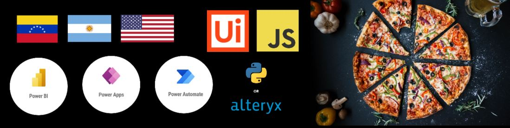

### Hi there 👋, I'm Fran!
#### Developer | Automation Specialist | Data Manager | Visual Integrations Enthusiast

I am originally from Venezuela, but I am currently in New York City. During my free coding hours, you will often find me Testing different technological advances, or Designing 3D printing models.

**Skills:** UiPath | Python | PowerBi | JavaScript | HTML | CSS

- 🔭 Currently working as a Freelancer
- 🌱 Learning the ins and outs of AI Integration & Large Scale Projects
- 👯 Open to collaborating on RPA projects and Code Challenges
- 🤔 Seeking insights on Apache and Nginx Migration
- 📫 Let's connect: [Email me](mailto:franciscovillahermosa@gmail.com)
- 😄 Pronouns: Dog & Pizza Lover 🐶🍕
- ⚡ Fun fact: Professional pizza eater! I hold a "doctorate" in Toy Story trivia and am a founding member of the Toy Story Latam Club.

#### Reach out to me:
- [Personal Page](https://techvilla.nicepage.io/?uid=83c16148-a0cf-4858-aeca-1f14ed5e44ad)
- [Twitter](https://twitter.com/franbucho)
- [LinkedIn](https://www.linkedin.com/in/fjvs-arg/)

#### Additional Functionality:
- 📊 Check out my latest [PowerBi Dashboard](link-to-dashboard)
- 🎨 See my latest UI/UX design projects [here](link-to-portfolio)
- 🤖 Exploring the depths of Machine Learning in my spare time
- 🌐 Stay tuned for upcoming articles on tech and automation trends

Feel free to drop me a message or connect on LinkedIn! Let's code, automate, and innovate together. 🚀
